# Data Structures in Elixir

>  The following was originally part of a presentation I did at the Elixir Melbourne meetup on the 19th May, 2022
## Intro

In functional languages we often program **declaratively**

Declarative programming favors immutability - this means that:

* Once we create the state of an object, we don't change it
* This makes the state of a program easier to **reason** about and more **secure**

In the following presentation we'll be covering three main data structures in Elixir:

* [Lists](#persistent-lists-in-elixir)
* [Tuples](#tuple)
* [Maps](#persistent-maps)

## How do we make immutable data performant?

A naive way to implement immutable data is just to copy the entire piece of data every time we need to change it

* e.g for `a = [1,2,3]` `List.append(a, 4)` copies the entire of `a` and adds a `4` on the end

The problem with this is that we get `O(n)` given the length of the list n

This is why we need **persistent data structures**

## Persistent data structures

Persistent data structures are **immutable**, but can **reuse** old parts of itself when modified (through **structural sharing**)

* This makes its **storage** and **operations** more efficient, as we're not cloning the entire data structure each time
* Below, the **new** data structure can point to already initialized pieces of data in the **old** data structure

<!-- livebook:{"break_markdown":true} -->


## Persistent Lists in Elixir

In Erlang/Elixir, the list is implemented using a linked list, rather than an array as you'd see in imperative languages like Python or C

## Difference between Linked List and an Array

In a singly linked list:

* The elements are not stored in contiguous memory locations
* The size of the linked list doesn’t need to be known in advance, it can increase at runtime depending on the number of elements dynamically

<!-- livebook:{"break_markdown":true} -->

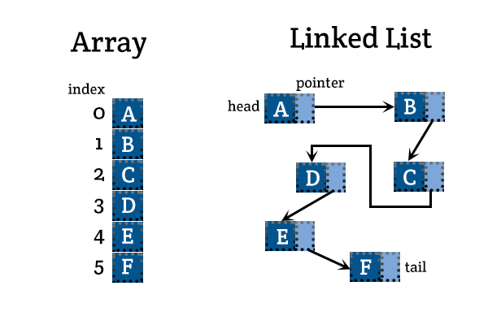

## So why don’t we use an Array to implement the persistent list?

* You'd have to clone the array every time to keep it immutable, which leads to O(N) time complexity
* Memory usage is also doubled since you need to keep the old array as you’re copying it to the new one

## Linked list operations: adding an element

* Adding to the beginning of a linked list is O(1). Adding to the rest of the list is O(n)

```elixir
a = [1, 2, 3]
b = [0 | a]
```

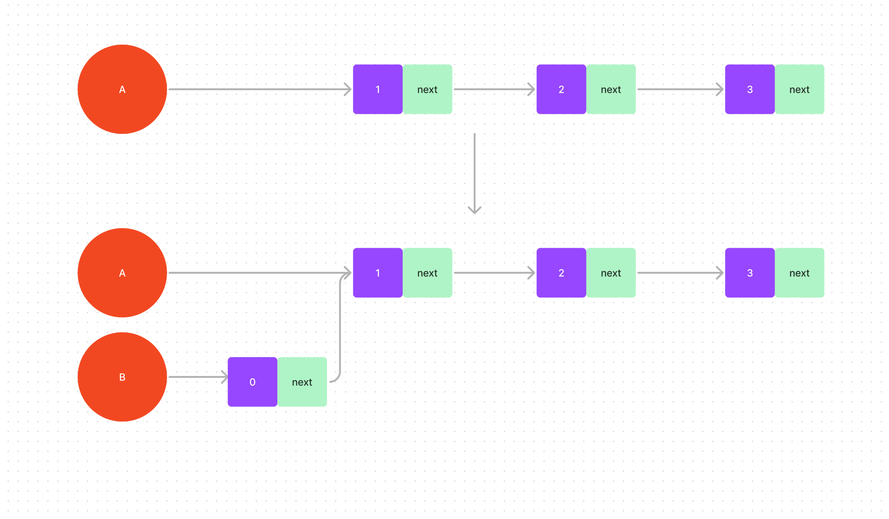

<!-- livebook:{"break_markdown":true} -->

* At the implementation level, we are just pointing `B` to a node with value `0`, and then that node to the head of `A`

<!-- livebook:{"break_markdown":true} -->


<!-- livebook:{"break_markdown":true} -->

in memory, `a` might look something like this

## Modifying the first element

* This is O(1) as well, as you can just create a new node, and point it to the head + 1th node

## What can we do with this knowledge ?

Let's reason about the `++` operator

## The ++ operator

When you call `C = A ++ B`, under the hood the left side `A` is copied, and then the last node is pointed to the list on the right

```elixir
a = [1, 2, 3]
b = [4, 5, 6]
```

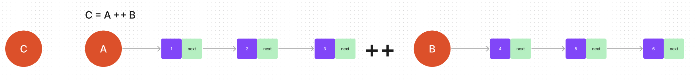

<!-- livebook:{"break_markdown":true} -->


<!-- livebook:{"break_markdown":true} -->

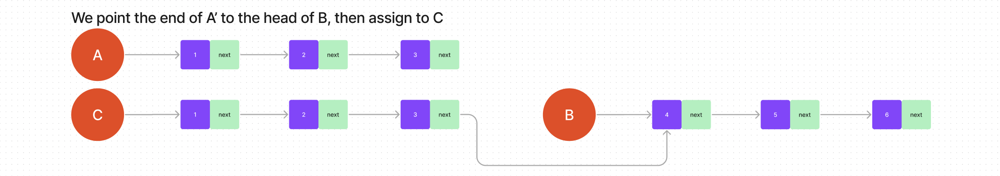

<!-- livebook:{"break_markdown":true} -->

So we can see here that the main cost of this operation is in the copying of the first list, A.

In general, the time complexity is O(n) where n is the length of the first list.

Let’s keep that in mind as we go through an example using this operator, to see how we can use this operator optimally.

## Reversing a list

### Naive solution

```elixir
defmodule Reverse do
  # A body recursive implementation
  def naive_reverse([head | tail]) do
    reverse_tail = naive_reverse(tail)
    new_head = [head]
    IO.write(inspect(reverse_tail))
    IO.write(" ++ ")
    IO.inspect(new_head)
    IO.inspect("-----------------")

    result = reverse_tail ++ new_head

    result
  end

  def naive_reverse([]) do
    []
  end
end

Reverse.naive_reverse([1, 2, 3, 4])
```

* We only care about what is on the left side
* Remember, `++` copies the entirety of whatever is on its left
* This means that for a list of length n, this algorithm will copy it n-1, n-2… 1 elements in total. Which leads to O(n^2) time complexity. This ain’t great!

## Better solution

```elixir
defmodule Reverse do
  def better_reverse([head | tail], acc) do
    reverse_tail = acc
    new_head = [head]

    IO.write(inspect(new_head))
    IO.write(" ++ ")
    IO.inspect(reverse_tail)
    IO.inspect("-----------------")

    better_reverse(tail, new_head ++ reverse_tail)
  end

  def better_reverse([], acc) do
    acc
  end
end

Reverse.better_reverse([1, 2, 3, 4], [])
```

* On the left side, we can see that we are only ever adding one element, rather than a whole list
* This means that we are only ever cloning one element per iteration
* For a list of length n, this algorithm will then copy it 1*n times, meaning O(n) time complexity. Nice!

```elixir
defmodule Reverse do
  def even_better_reverse(list, acc \\ [])

  def even_better_reverse([head | tail], acc) do
    even_better_reverse(tail, [head | acc])
  end

  def even_better_reverse([], acc) do
    acc
  end
end

Reverse.even_better_reverse([1, 2, 3, 4])
```

| Operation | Time Complexity                           |
| --------- | ----------------------------------------- |
| Access    | `O(n)`                                    |
| Search    | `O(n)`                                    |
| Insertion | `O(1)` for pre-pending, otherwise `O(n)`   |
| Deletion  | `O(1)` if first element, otherwise `O(n)` |

<!-- livebook:{"break_markdown":true} -->

As you can see, Linked Lists are really good for insertion, but not so great for access/search

## Tuple

* Under the hood, a tuple’s implementation is just an array
  * This means that they are not persistent
    * Every time you want to update a tuple, a new one must be created (since we still want to keep things immutable).
* No references to the old tuple are used
* For example, the tuple

```elixir
a = {a, 42, :ok}
```

looks something like this in memory

<!-- livebook:{"break_markdown":true} -->


<!-- livebook:{"break_markdown":true} -->

This means that we have

| Operation | Time Complexity |
| --------- | --------------- |
| Access    | O(1)            |
| Search    | O(n)            |
| Insertion | O(n)            |
| Deletion  | O(n)            |

So they’re really good for **reading**, but not so great for **creating**, **inserting** and **deleting**.

This means that they are ideal when you have small list of values that need be accessed quickly
This makes sense when you see where they are commonly used, like in function returns as well as pattern matching

```elixir
{:ok, 1}
```

## When to use lists vs tuples?

* When you want fast read time, but won't be changing the value much, use `Tuples`
  * So they are often used in return tuples like `{:ok, 1}`
* When you are inserting frequently and need it to be fast use the `List`
  * For example when aggregating values

## Persistent Maps

map/dictionary

<!-- livebook:{"break_markdown":true} -->

* In Elixir, maps aren't implemented as a HashMap like in other imperative languages like Python or C.
  * HashMaps aren't great if you want a performant immutable key/value store
  * Its hard to update key/value pairs without duplicating the entire data structure

## Maps with <32 keys

* Maps with less than 32 keys are flat-maps, implemented as a sorted list of tuples

<!-- livebook:{"break_markdown":true} -->

As an example, let us look at how the map `%{a => foo, z => bar}` is represented:

<!-- livebook:{"break_markdown":true} -->


<!-- livebook:{"break_markdown":true} -->

* Since it is sorted, this means that we can actually predict the order of its keys

```elixir
m = %{
  "a" => "foo",
  "z" => "bar",
  3 => nil,
  4 => nil,
  5 => nil,
  6 => nil,
  7 => nil,
  8 => nil,
  9 => nil,
  10 => nil,
  11 => nil,
  12 => nil,
  13 => nil,
  14 => nil,
  15 => nil,
  16 => nil,
  17 => nil,
  18 => nil,
  19 => nil,
  20 => nil,
  21 => nil,
  22 => nil,
  23 => nil,
  24 => nil,
  25 => nil,
  26 => nil,
  27 => nil,
  28 => nil,
  29 => nil,
  30 => nil,
  31 => nil,
  32 => nil
}

m |> Map.keys()
```

How come the "a" and "z" keys are at the end though?

* In Elixir, all values (terms) can be compared with each other. 
  * This means that the order of the keys is predictable
* The priority of values (terms) is
  * `number < atom < reference < function < port < pid < tuple < map < list < bitstring`
* Since numbers are smaller than bitstrings, they all come before the strings (which are represented as lists in erlang/elixir)

<!-- livebook:{"break_markdown":true} -->

ok, but what happens if we have > 32 keys ...

```elixir
m = %{
  1 => nil,
  2 => nil,
  3 => nil,
  4 => nil,
  5 => nil,
  6 => nil,
  7 => nil,
  8 => nil,
  9 => nil,
  10 => nil,
  11 => nil,
  12 => nil,
  13 => nil,
  14 => nil,
  15 => nil,
  16 => nil,
  17 => nil,
  18 => nil,
  19 => nil,
  20 => nil,
  21 => nil,
  22 => nil,
  23 => nil,
  24 => nil,
  25 => nil,
  26 => nil,
  27 => nil,
  28 => nil,
  29 => nil,
  30 => nil,
  31 => nil,
  32 => nil,
  33 => nil
}

m |> Map.keys()
```

What happened? This is because when we exceed 32 keys, Maps become implemented using a different data structure, the Hash Array Mapped Trie (HAMT) so it is no longer sorted.

A number of other functional languages also use this data structure to implement their Map (e.g Scala, Clojure)

## Maps with > 32 keys with the HAMT (Hash Array Mapped Tree)

* HAMT combines
  * Hashing
  * Trie data structure
    #### Disclaimer
* I will be using a simplified version of the HAMT and much lower values (e.g 8 bit hash instead of 32 bits) for the ease of explanation

## Tries

* Using Tries, we can store keys (or strings)
* They allow for efficient insertion and re**Trie**val of strings

<!-- livebook:{"break_markdown":true} -->


<!-- livebook:{"break_markdown":true} -->


<!-- livebook:{"break_markdown":true} -->

* As you can see, this allows us to “reuse” the parts of the string that is shared.
* Naively, you could even implement some kind of Map with this data structure like this
* Lets say we wanted to store  `a = %{"elmo" => "cute", "elixir" => "awesome"}`

<!-- livebook:{"break_markdown":true} -->


<!-- livebook:{"break_markdown":true} -->

* This way, if you call `Map.get(a, "elixir")` , you can just “walk” down the tree until you hit a leaf, and get the value at the leaf.
* This isn’t great though, for a couple of reasons
  * The tree can become pretty deep. Ideally we’d want a shallow tree (means less steps to get to our value)
  * Lookup will take O(n), where n is the length of the key (we can do better)

This is where Hashing comes in

## Hashing

Hashing gives us an alternative "key" to use to insert into the Trie

* For example, we can hash `"elmo"` to `"11100000"` and insert this as our **key** instead of `"elmo"`

The advantage of this is:

* Our keys (and therefore the depth of the Trie) is now fairly predictable
* We can use bit manipulation and various tricks to make storage and operations efficient since our key is now a binary

<!-- livebook:{"break_markdown":true} -->

Lets say that we're inserting `A = %{"elmo" => "cute", "elixir" => "awesome"}`

```elixir
defmodule HashHelper do
  def pad_with_zeroes(binary) do
    case {binary, String.length(binary)} do
      {_, 32} ->
        binary

      {binary, _} ->
        pad_with_zeroes("0" <> binary)
    end
  end

  def partition_hash(hash) do
    for <<hashed_partition::binary-2 <- hash>>, do: hashed_partition
  end

  def hash(key) do
    IO.inspect(:erlang.phash2(key))

    # I reverse the string here because I realized I did the diagram the wrong way around after I generated this data ..
    :erlang.phash2(key)
    |> :erlang.integer_to_binary(2)
    |> pad_with_zeroes()
    |> String.reverse()
    |> String.slice(-8, 8)
  end
end

"elmo" |> HashHelper.hash() |> IO.inspect(label: "hash(elmo) ")
"elixir" |> HashHelper.hash() |> IO.inspect(label: "hash(elixir)")
"elsa" |> HashHelper.hash() |> IO.inspect(label: "hash(elsa)")
```

* So we're inserting `A = %{"elmo" => "cute", "elixir" => "awesome"}`

* We hash "elmo" and "elixir" to get

  * `hash(elmo) = "11100000"`, `hash(elixir) = "10000000”`

* So instead of inserting the letters of the key into the trie, we can just insert using this binary representation

<!-- livebook:{"break_markdown":true} -->

Technically, we could just insert them like this,

<!-- livebook:{"break_markdown":true} -->

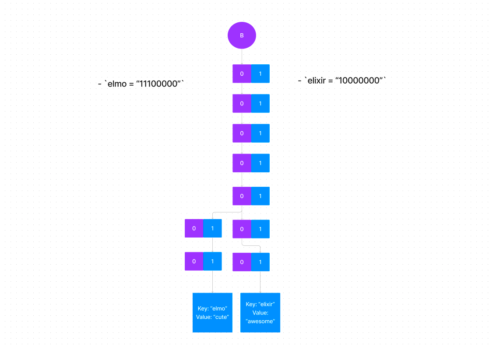

<!-- livebook:{"break_markdown":true} -->

But this means that the tree becomes really deep, as it will take 8 steps each time to reach a leaf

* We want wider trees for faster lookup

To create wider trees, we can split them into 2 bit sections

```elixir
"elmo" |> HashHelper.hash() |> HashHelper.partition_hash() |> IO.inspect(label: "hash(elmo) ")
"elixir" |> HashHelper.hash() |> HashHelper.partition_hash() |> IO.inspect(label: "hash(elixir)")
"elsa" |> HashHelper.hash() |> HashHelper.partition_hash() |> IO.inspect(label: "hash(elsa)")
```

* So when we are inserting or looking up, we check the hashed binary 2 bits at a time (instead of 1)
  * So to insert "elmo" we first look at “00”, then “00” again, and then “10” …

<!-- livebook:{"break_markdown":true} -->


## Cloning a HAMT

We can easily clone by pointing the new variable to the head of the new variable to the same object

```elixir
a = %{"elmo" => "cute", "elixir" => "awesome"}
b = a
```

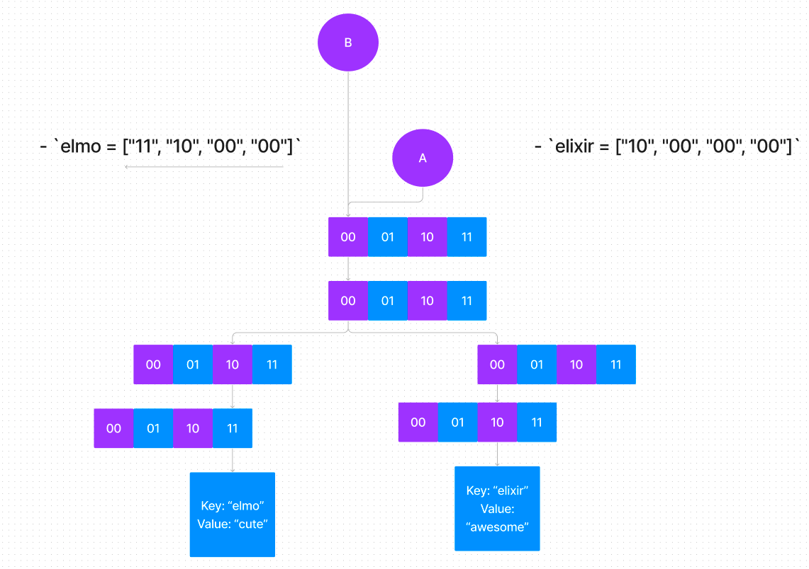

## Adding to a HAMT

Say we wanted to add the key value pair `"elsa" => "princess"`  to A

```elixir
a = %{"elmo" => "cute", "elixir" => "awesome"}
b = Map.put(a, "elsa", "princess")
a |> IO.inspect()
```

```elixir
c = %{a: 1}
```

* `elsa = ["00", "00", "00", "00"]`
* Here, `elsa` would follow the same path as “elixir” ["10", "00", "00", "00"] for 3 nodes, and then diverge.
  * But we can’t modify the original Trie since this would be a mutation
* How can we add the new key value pair while still retaining the key value pairs?
* Lets first clone A and assign to B

<!-- livebook:{"break_markdown":true} -->

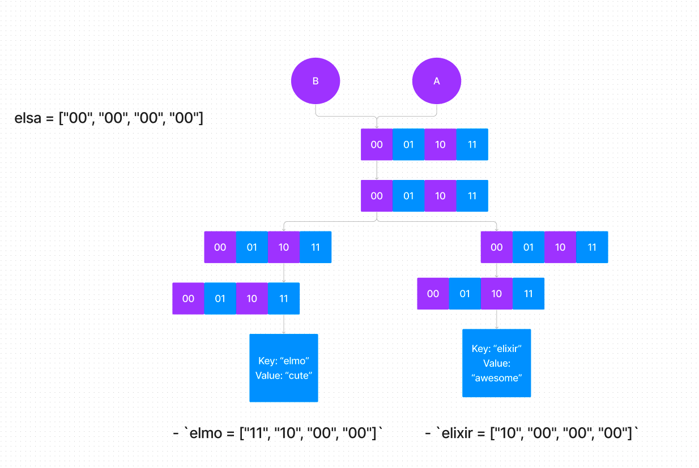

<!-- livebook:{"break_markdown":true} -->

* Now lets insert `"elsa" => "princess"`
* We will do this by inserting 2 bits of its hash at a time
* We can see that the first section, `00` already exists in A’s tree
* We don’t want to modify A’s trie, so we create this node in B and copy all the pointers that it has to A’s nodes

<!-- livebook:{"break_markdown":true} -->

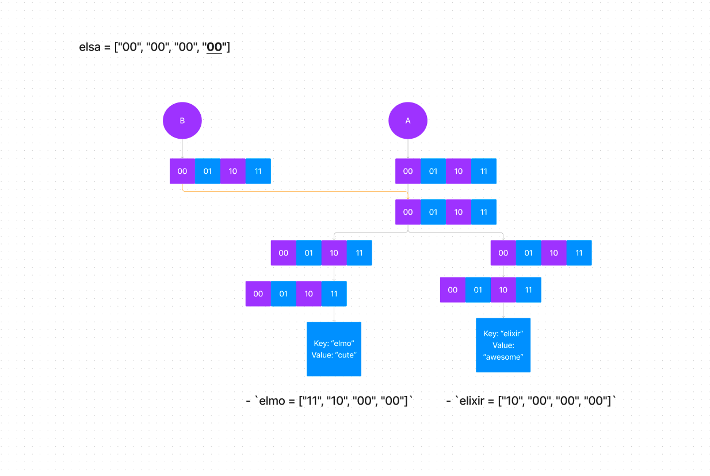

<!-- livebook:{"break_markdown":true} -->

* Lets look at the second section, the `00` already exists in A’s tree as well, so we create our own node in B and copy all the pointers that it has to A’s nodes

<!-- livebook:{"break_markdown":true} -->

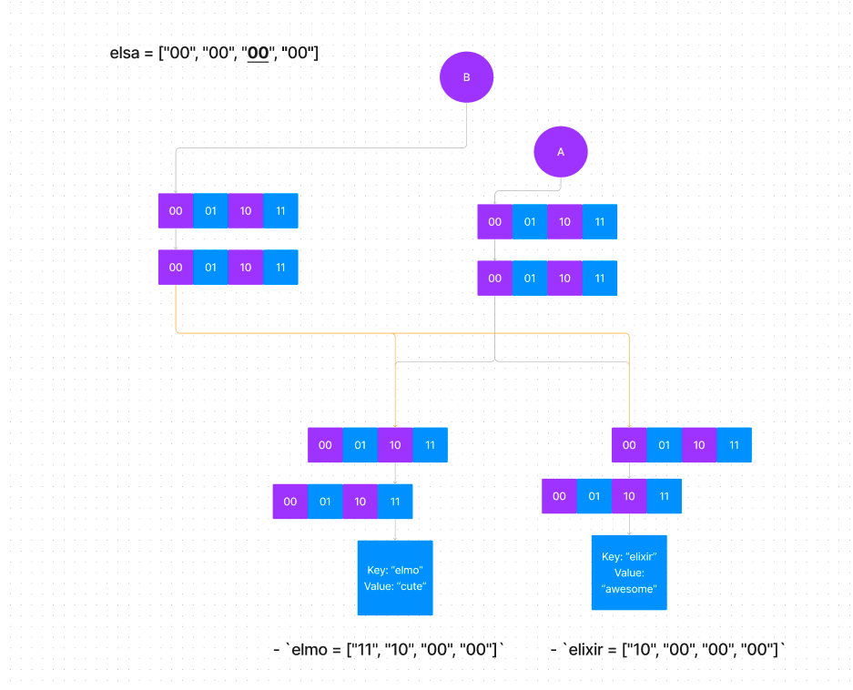

<!-- livebook:{"break_markdown":true} -->

* Lets look at the third section, the 00 again already exists in A’s tree, so we create our own node in B and copy all the pointers that it has to A’s nodes

<!-- livebook:{"break_markdown":true} -->

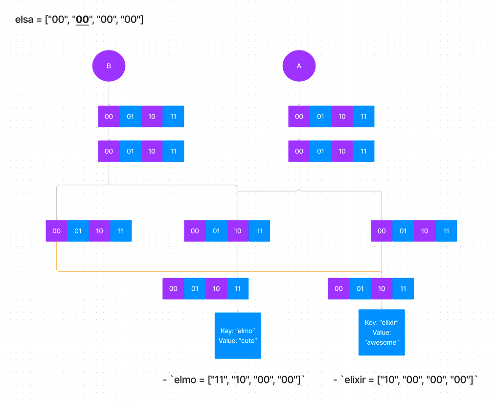

<!-- livebook:{"break_markdown":true} -->

* Lets look at the fourth section, the `00` finally doesn’t have a connection in A’s tree, so we can create the node in our own tree without linking it to A's tree
* This is also the final section, so we can connect it to the key/value

<!-- livebook:{"break_markdown":true} -->

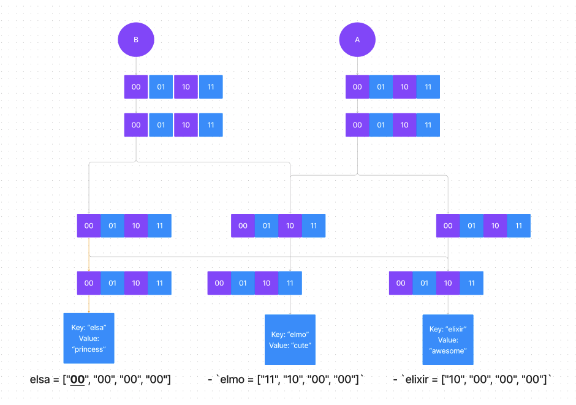

<!-- livebook:{"break_markdown":true} -->

So in this way, the Hash array mapped trie can effectively use old data structures when creating new ones, without mutating the old data structures

* If you follow the paths down in the trie for A, you can see that it is unchanged - there is no way for it to reach the new paths created by b.

* B on the other hand has access to the nodes in A, as well as the new value inserted for "elsa".

* This is how it doesn’t duplicate the HashMap every time it needs to create a new copy or add items.

## Actual implementation in Erlang

* I’ve taken simplified a lot of stuff from how its actually implemented in the Erlang BEAM, so heres some info
* The actual implementation:
  * Hashes keys into a 32 bit integer instead of a 8 bit integer, so collisions are much less likely to occur
  * Each section it looks at is 4 bits long instead of 2 bits
  * The pointers to nodes are stored much more efficiently.
    * You can notice in our diagrams that a lot of the array spaces in the nodes are empty - only the sections used in our words are used. This is pretty inefficient
    * Instead of an array as we have shown here, they use a much more condensed implementation using a bitarray. If you want to know more about this you can check our their implementation code below or ask me about it afterwards.
  * They also use heaps of bit manipulations to make it *blazingly fast*

Below is the implementation of the get for the Map implementation in Erlang's OTP with some comments for my own understanding and reference. Source link [here](https://github.com/erlang/otp/blob/7bb67891eea35259c0a24ed1f54098ae1b454cea/erts/emulator/beam/erl_map.c)

<!-- livebook:{"break_markdown":true} -->

```
// hx is the hashed key
const Eterm *
erts_hashmap_get(Uint32 hx, Eterm key, Eterm node)
{
    /* thing_word tagscheme
     * Need two bits for map subtags
     *
     * Original HEADER representation:
     *
     *     aaaaaaaaaaaaaaaa aaaaaaaaaatttt00       arity:26, tag:4
     *
     * For maps we have:
     *
     *     vvvvvvvvvvvvvvvv aaaaaaaamm111100       val:16, arity:8, mtype:2
     *
     * unsure about trailing zeros
     *
     * map-tag:
     *     00 - flat map tag (non-hamt) -> val:16 = #items
     *     01 - map-node bitmap tag     -> val:16 = bitmap
     *     10 - map-head (array-node)   -> val:16 = 0xffff
     *     11 - map-head (bitmap-node)  -> val:16 = bitmap
     */

    // hval is any one of the map-tag values above
    // if 0xffff, it is an array node

    /* erl_map.h stuff */
    Eterm *ptr, hdr, *res;
    Uint ix, lvl = 0;
    Uint32 hval, bp;

    ASSERT(is_boxed(node));
    // node is a pointer
    ptr = boxed_val(node);
    // dereferences the pointer to get the header value
    hdr = *ptr;
    ASSERT(is_header(hdr));
    ASSERT(is_hashmap_header_head(hdr));
    ptr++;

    // NOTE: Infinite loop
    for (;;)
    {
        hval = MAP_HEADER_VAL(hdr);
        // hx is the hashed key
        // hashmap_index scopes hx to the current last 4 bits
        ix = hashmap_index(hx);
        // ix stores the index (ix corresponds to the ith element)

        // If we are not in an array node, i.e we are in a bitmap
        if (hval != 0xffff)
        {
            // bp is 100000... where its length is ix
            // you can use this to get the ith value of hval by doing bp & hval
            // hval here is the bitmap
            // so we are checking whether the ith value of the bitmap is set
            // if it isn't set then we return null since the next node does not exist
            bp = 1 << ix;
            if (!(bp & hval))
            {
                /* not occupied */
                res = NULL;
                break;
            }
            // If we're here, that means that the next value does indeed exist, from our hashed key
            // hval & (bp - 1) first filters the bitmask to only contain bits to the right of our bit at the ix'th index
            // we then count the number of bits to get the index of the array node that contains the pointer to the next node
            ix = hashmap_bitcount(hval & (bp - 1));
        }
        // Go to the next node
        node = ptr[ix + 1];

        // If our new node is a list, then the pointer is actually pointing to a key value pair
        // If our original key is equal to the key stored at the pointer, then return the value
        // Otherwise, we have a mismatch, return NULL
        if (is_list(node))
        { /* LEAF NODE [K|V] */
            ptr = list_val(node);
            res = EQ(CAR(ptr), key) ? &(CDR(ptr)) : NULL;
            break;
        }

        // Our levels go from 0 to 7 (inclusive) since we look at 4 bits each time.
        // Since our level is never changed in this function, we always shift by 4
        // #define hashmap_shift_hash(Hx, Lvl, Key)                                      \
        //     (((++(Lvl)) & 7) ?                                                        \
        //      (Hx) >> 4 :                                                              \
        //      make_map_hash(Key, ((Lvl) >> 3)))
                // we shift by 3 at the last level since base 16 has

        hx = hashmap_shift_hash(hx, lvl, key);

        ASSERT(is_boxed(node));
        ptr = boxed_val(node);
        hdr = *ptr;
        ASSERT(is_header(hdr));
        ASSERT(!is_hashmap_header_head(hdr));
    }

    return res;
}
```

## Performance

| Operation | Time Complexity                                             |
| --------- | ----------------------------------------------------------- |
| Access    | O(log n)                                                    |
| Search    | O(log n)                                                    |
| Insertion | O(n) for < 32 elements, O(log n) for >= 32 elements [2] |
| Deletion  | O(n) for < 32 elements, O(log n) for >= 32 elements      |

Since we have a Trie data structure, most things like insertion and deletion take O(log_32(n))

This isn’t too bad though as our Trie’s depth is limited to the hash length / section length, which is usually around 7-8

In practice, it is almost as performant as the regular old HashTable that allows O(n) access


## Conclusion

Diving into the implementations of data structures in Elixir was really interesting! 
I'd always have a nagging thought that I didn't really understand what was happening beneath the surface when coding, 
so it was a bit of a relief to finally gain some understanding of how these common data structures work in Elixir!

Please let me know if you spot any issues/incorrect statements in what i've written above!^^
## Source

- You can find the markdown source for this post [here](https://github.com/kvnyu/ds_elixir)

## References

https://github.com/erlang/otp

https://iq.opengenus.org/time-complexity-of-array/

https://iq.opengenus.org/time-complexity-of-linked-list/

https://softwareengineering.stackexchange.com/questions/294983/why-do-haskell-and-scheme-use-singly-linked-lists

https://dev.to/edisonywh/-elixir--why-linked-lists--1e9d

https://stackoverflow.com/questions/25779783/practical-difference-between-erlang-mapsremove-2-and-mapswithout-2

https://softwareengineering.stackexchange.com/questions/132309/why-are-cons-lists-associated-with-functional-programming

https://gist.github.com/PJUllrich/4cd3d8e2e8c9170b560e5a501c13c9f3

https://stackoverflow.com/questions/28676383/erlang-array-vs-list

https://hypirion.com/musings/understanding-persistent-vector-pt-1

https://www.quora.com/How-does-a-persistent-data-structure-in-functional-programming-work

https://stackoverflow.com/questions/4399837/what-is-the-benefit-of-purely-functional-data-structure

https://doc.lagout.org/programmation/Functional%20Programming/Chris_Okasaki-Purely_Functional_Data_Structures-Cambridge_University_Press%281998%29.pdf

https://stackoverflow.com/questions/599153/are-some-data-structures-more-suitable-for-functional-programming-than-others
https://inquisitivedeveloper.com/lwm-elixir-47/#:~:text=Maps%20in%20Elixir%20aren't,performance%20that%20hash%20tables%20have.

https://inquisitivedeveloper.com/lwm-elixir-14/

https://www.openmymind.net/Elixir-A-Little-Beyond-The-Basics-Part-1-lists/

https://www.openmymind.net/Elixir-A-Little-Beyond-The-Basics-Part-3-maps/

https://ferd.ca/erlang-s-tail-recursion-is-not-a-silver-bullet.html

https://www.erlang.org/doc/efficiency_guide/myths.html#myth--operator--++--is-always-bad

https://blog.acolyer.org/2015/11/27/hamt/

https://worace.works/2016/05/24/hash-array-mapped-tries/

https://www.erlang.org/doc/efficiency_guide/maps.html

https://www.slideshare.net/ErlangSolutionsLtd/erlang-meetup-19-september-2017

https://github.com/python/cpython/blob/main/Python/hamt.c

https://moaazsidat.com/writings/2015-11-24-supercharging-react-with-immutablejs.md

https://lampwww.epfl.ch/papers/idealhashtrees.pdf

https://www.honeybadger.io/blog/elixir-memory-structure/

